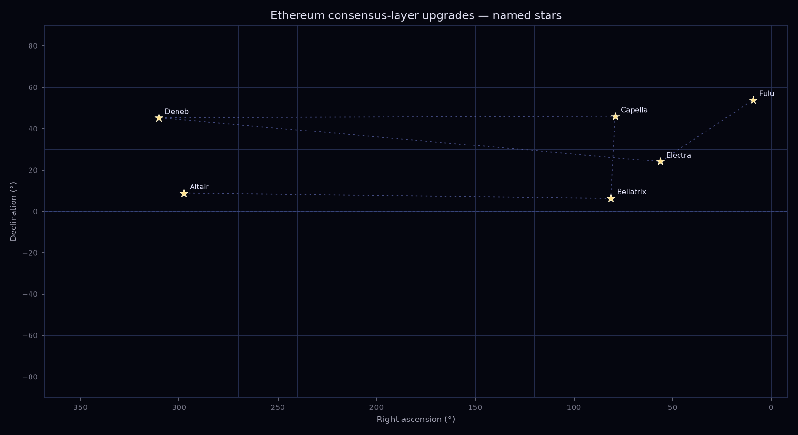

<table align="center">
<tr><td align="center" width="640">

## ▶&nbsp; [Open the interactive map](https://oyatrino.github.io/ethupgrademap/)

🌍 &nbsp;Execution-layer cities on a globe &nbsp;·&nbsp; ✨ &nbsp;consensus-layer stars on a celestial chart

</td></tr>
</table>

# ethereum upgrade map — cities & stars

Mapping Ethereum's dual-layer upgrade naming onto two projections: **execution-layer
upgrades as cities on a globe**, **consensus-layer upgrades as stars on a celestial
chart**.

**[▶ View the interactive map](https://oyatrino.github.io/ethupgrademap/)** — switch between
the 🌍 execution globe and the ✨ consensus star chart.

## The naming scheme

Since 2021, Ethereum names its two layers on different schemes — now formalised in
**[EIP-8133](https://eips.ethereum.org/)**:

- **Execution layer → Devcon / Devconnect host cities**, in chronological order:
  Berlin → London → Paris (the Merge) → Shanghai → Cancún → Prague → Osaka → Amsterdam.
  Real, mappable places, each tied to an event date — so the chronology renders as a
  **travel route** rather than scattered points.
- **Consensus layer → stars**, advancing alphabetically by first letter:
  Altair → Bellatrix → Capella → Deneb → Electra → Fulu → Gloas. Not mappable on a globe,
  but trivially mappable on a **celestial sphere** using right ascension / declination.

Post-Merge upgrades bundle one of each into a portmanteau:

| Network upgrade | Execution (city) | Consensus (star) |
| --- | --- | --- |
| Shapella | Shanghai | Capella |
| Dencun | Cancún | Deneb |
| Pectra | Prague | Electra |
| Fusaka | Osaka | Fulu |
| Glamsterdam | Amsterdam | Gloas |

The scheme is explicitly forward-looking, giving geographic neutrality and predictable
sequencing — so this map just grows as new forks are named.

## Data

[`upgrades.json`](upgrades.json) is the single source the interactive map reads at runtime.
It is produced from the hand-curated [`upgrades.seed.json`](upgrades.seed.json) by
[`scripts/build_data.py`](scripts/build_data.py), which auto-fills coordinates.

Names that don't resolve yet (e.g. the proposed star "Gloas") fall back to a curated table
and are simply left unplotted until coordinates exist. Activation dates are curated.

## data sources

* **Upgrade names & city/star pairing** — the naming convention itself, formalised in
  [EIP-8133](https://eips.ethereum.org/), curated by hand in
  [`upgrades.seed.json`](upgrades.seed.json).
* **Execution-layer city coordinates (`lat`/`lon`)** — OpenStreetMap Nominatim:
  https://nominatim.openstreetmap.org
* **Consensus-layer star coordinates (`ra`/`dec`)** — the CDS Sesame name resolver:
  https://cds.unistra.fr/cgi-bin/Sesame

## Static renders

[`scripts/generate_maps.py`](scripts/generate_maps.py) produces:

- `starchart.png` — consensus stars on an RA/Dec plane (matplotlib only)
- `globe.png` — execution cities on a Robinson world map (cartopy)
- `pairings.png` — both projections stacked, with a line linking each portmanteau's
  city to its paired star

## Updating (≈ twice a year)

When a new fork is named:

1. Add an entry to `upgrades.seed.json` (name, the city/star pairing, status, date).
2. Run `python scripts/build_data.py` to refresh `upgrades.json` + `upgrade-count.json`.
3. Run `python scripts/generate_maps.py` for the static images.
4. Commit.

The `update.yml` workflow does steps 2–3 on a twice-a-year schedule and uploads the
results as a **build artifact** — the `oyatrino` org blocks GitHub Actions from pushing or
opening PRs, so you download the artifact and commit it.

---

A companion to [oyatrino/tezosprotocolmap](https://github.com/oyatrino/tezosprotocolmap),
which maps Tezos protocol-name cities.
